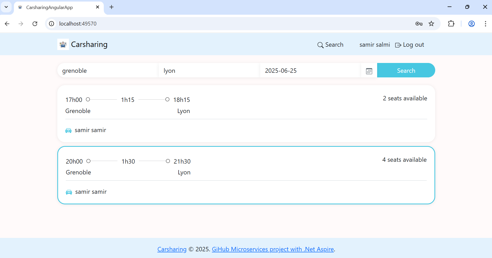

# Carsharing Application — Microservices Demo with .NET Aspire ( work-in-progress)

## 1. Introduction

The main purpose of this repository is to build a carsharing application to demonstrate microservices architecture, Clean Architecture, and the CQRS pattern, implemented using the .NET Aspire development stack.
The application consists of:
- Two microservices: Users and Rides
- A web frontend developed with Angular 19
- Asynchronous communication between services via RabbitMQ
- Identity and access management handled through Keycloak

Each service exposes REST APIs, and there are example requests in the Postman collection: Docs/Postman collection/Car sharing.postman_collection.json.

## Run The Project
You will need the following tools:

* [.Net Core 9](https://dotnet.microsoft.com/download/dotnet-core/8)
* [Docker Desktop](https://www.docker.com/products/docker-desktop)
* [Node.js 18.19.1 or later](https://nodejs.org/en/download)
* [Angular 19](https://angular.dev/installation)
* [Visual Studio 2022 (optionel)](https://visualstudio.microsoft.com/downloads/)

### Run the project using .NET CLI

1. Start Docker Desktop.
3. Open a command prompt.
4. Navigate to the CarSharing\src\Aspire\AppHost directory (this folder contains the AppHost.csproj file).
5. Run the command: dotnet run
   
   
   
7. Once the application starts, the dashboard URL will be displayed at the end of the logs.

## FrontEnd application

Note: Even though the angular-app state is marked as started, the application may take some time to fully initialize.

### Application screenshots

